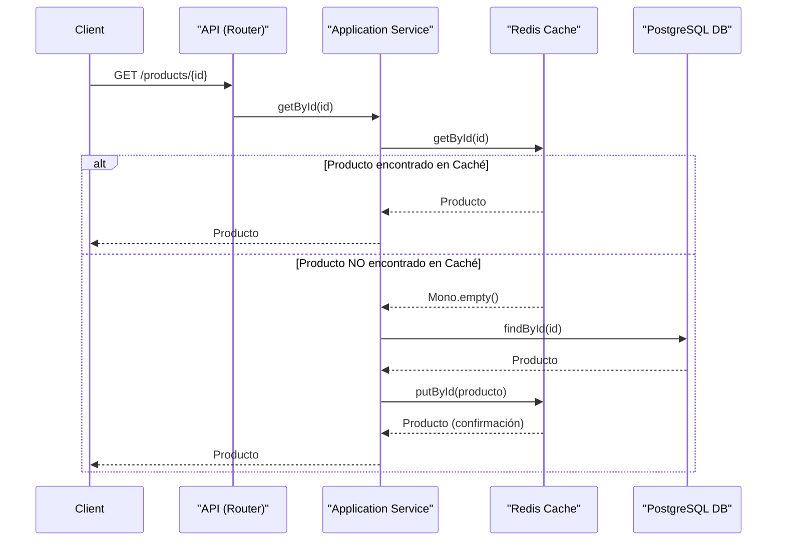

# Microservicio Reactivo de Productos

Este proyecto es un microservicio reactivo construido con Spring Boot y Java 17, diseñado para gestionar un catálogo de productos. La aplicación sigue los principios de la Arquitectura Hexagonal (Puertos y Adaptadores) para mantener un bajo acoplamiento y una alta cohesión, facilitando su mantenimiento y escalabilidad.

## ✨ Características Principales

-   **Programación Reactiva**: Construido completamente con Project Reactor (Mono/Flux) para un rendimiento óptimo y un manejo eficiente de la concurrencia.
-   **Gestión de Productos**: Operaciones CRUD (Crear, Leer, Actualizar, Eliminar) completas para productos.
-   **Paginación**: Soporte para la obtención de productos de forma paginada.
-   **Manejo de Imágenes**: Almacenamiento de metadatos de imágenes en MongoDB.
-   **Caché de Alto Rendimiento**: Integración con Redis para cachear consultas frecuentes y mejorar los tiempos de respuesta.
-   **Tolerancia a Fallos**: Implementación del patrón Circuit Breaker para gestionar la resiliencia del sistema.
-   **Contenerización**: Totalmente contenerizado con Docker y orquestado con Docker Compose para un despliegue sencillo y consistente.

## 🚀 Stack Tecnológico

| Componente          | Tecnología                                           |
| ------------------- | ---------------------------------------------------- |
| **Lenguaje**        | Java 17                                              |
| **Framework**       | Spring Boot 3 (WebFlux)                              |
| **Base de Datos**   | PostgreSQL 15 (con R2DBC para acceso reactivo)       |
| **Base de Datos Documental** | MongoDB 6 (para metadatos de imágenes)      |
| **Caché**           | Redis 7                                              |
| **Contenerización** | Docker & Docker Compose                              |
| **Build Tool**      | Gradle                                               |
| **API Docs**        | OpenAPI (Swagger)                                    |

## 🏗️ Arquitectura del Sistema

El proyecto implementa una **Arquitectura Hexagonal (Puertos y Adaptadores)**, que separa claramente el núcleo de la lógica de negocio de los detalles de infraestructura.

```mermaid
graph TD
    subgraph " "
        direction LR
        subgraph "CORE (Lógica de Negocio)"
            direction TB
            A[Domain: Entidades y Lógica Pura]
            B[Application: Casos de Uso]
        end
        subgraph "INFRASTRUCTURE (Adaptadores)"
            direction TB
            C[API REST <br/>(Spring WebFlux)] --> B
            D[Adaptador de Persistencia <br/>(PostgreSQL - R2DBC)]
            E[Adaptador de Caché <br/>(Redis)]
            F[Adaptador de Documentos <br/>(MongoDB)]
        end
    end

    B --> I1(Puerto de Salida <br/>- DB)
    B --> I2(Puerto de Salida <br/>- Caché)
    B --> I3(Puerto de Salida <br/>- Documentos)

    I1 --> D
    I2 --> E
    I3 --> F

    style CORE fill:#dae8fc,stroke:#6c8ebf,stroke-width:2px
    style INFRASTRUCTURE fill:#d5e8d4,stroke:#82b366,stroke-width:2px
```

-   **Domain**: Contiene las entidades del negocio (`Products`, `Image`) y las interfaces (puertos) que definen los contratos para la comunicación con el exterior. Es el corazón de la aplicación y no depende de ninguna tecnología externa.
-   **Application**: Orquesta los casos de uso (ej. "crear un producto"). Utiliza los puertos del dominio para ejecutar la lógica de negocio.
-   **Infrastructure**: Implementa los adaptadores para los puertos definidos en el dominio. Aquí se encuentra el código que interactúa con tecnologías concretas como Spring WebFlux, PostgreSQL, Redis y MongoDB.

## 🎨 Patrones de Diseño Utilizados

-   **Arquitectura Hexagonal (Puertos y Adaptadores)**: Desacopla la lógica de negocio de la infraestructura.
-   **Inyección de Dependencias**: Utilizado por Spring para gestionar el ciclo de vida de los componentes.
-   **Repositorio**: Abstrae el acceso a los datos, permitiendo cambiar la fuente de datos sin afectar la lógica de negocio.
-   **Data Transfer Object (DTO)**: Se usa para transferir datos entre las capas de la API y los casos de uso, evitando exponer las entidades del dominio.
-   **Circuit Breaker**: Implementado para prevenir fallos en cascada cuando un servicio externo (como la caché) no está disponible.
-   **Cache-Aside**: Estrategia de caché donde la aplicación consulta primero la caché. Si no encuentra el dato, lo busca en la base de datos y luego lo almacena en la caché para futuras peticiones.

## 🌊 Diagrama de Flujo: Obtener Producto por ID

Este diagrama ilustra el flujo de una petición para obtener un producto, incluyendo la estrategia de caché "Cache-Aside".



## 🚀 Cómo Empezar

### Prerrequisitos

-   [Docker](https://www.docker.com/get-started) y [Docker Compose](https://docs.docker.com/compose/install/) instalados.
-   Tener el puerto `8083` disponible en la máquina host.

### Ejecución

1.  **Clona el repositorio (si es necesario):**
    ```bash
    git clone <URL_DEL_REPOSITORIO>
    cd <NOMBRE_DEL_DIRECTORIO>
    ```

2.  **Construye y levanta los servicios:**
    Abre una terminal en la raíz del proyecto (donde se encuentra el archivo `docker-compose.yml`) y ejecuta:
    ```bash
    docker-compose up --build
    ```
    Este comando construirá la imagen de la aplicación Java y levantará todos los contenedores (`postgres`, `mongodb`, `redis` y la propia aplicación) en el orden correcto.

3.  **Accede a la aplicación:**
    -   **API**: La aplicación estará disponible en `http://localhost:8083`.
    -   **Documentación de la API (Swagger)**: `http://localhost:8083/swagger-ui.html`

### Estructura del Proyecto

```
.
├── src
│   ├── main
│   │   ├── java
│   │   │   └── com/example/demo
│   │   │       ├── application  # Casos de uso y lógica de aplicación
│   │   │       ├── domain       # Entidades, lógica de negocio y puertos
│   │   │       └── infrastructure # Controladores, repositorios, DTOs y configuración
│   │   └── resources
│   │       └── application.properties # Configuración (usada como base para variables de entorno)
│   └── test
├── build.gradle        # Dependencias y configuración de build
├── dockerfile          # Instrucciones para construir la imagen de la aplicación
└── docker-compose.yml  # Orquestación de todos los servicios
```

